# 9 Relations

## 9.1 Relations and Their Properties

### 9.1.1 Introduction

#### Definition: Binary Relation

Let $A$ and $B$ be sets. A **binary relation** from $A$ to $B$ is a subset of $A \times B$. The notation $aRb$ is used to denote $(a,b) \in R$ and $a \not R b$ is $(a,b) \not \in R$.

### 9.1.3 Relations on a Set

#### Definition: Relations on a Set

A **relation on a set** $A$ is a relation from $A$ to $A$, or a subset of $A \times A$.

### 9.1.4 Properties of Relations

- **Reflexive**: for $a \in A, (a,a) \in R$.
- **Symmetric**: for $a, b \in A, (a,b) \in R \implies (b,a) \in R$.
- **Antisymmetric**: for $a, b \in A, (a,b) \in R \implies (b,a) \notin R$.
- **Transitive**: for $a,b,c \in A, (a,b) \in R \land (b,c) \in R \implies (a,c) \in R$.

### 9.1.5 Combining Relations

#### Definition: Composite

Let $R$ be a relation from a set $A$ to a set $B$ and $S$ a relation from $B$ to a set $C$. The **composite** of $R$ and $S$, denoted by $S \circ R$, is the relation consisting of ordered pairs $(a,c)$, where $a \in A, c \in C$, and for which there exists an element $b \in B$ such that $(a,b) \in R$ and $(b,c) \in S$.

#### Definition: Self-Relation

Let $R$ be a relation on the set $A$. The powers $R^{n}, n = 1, 2, 3, \cdots$, are defined as

$$
R^{1} = R \quad \text{and} \quad R^{n+1} = R^{n} \circ R.
$$

#### Theorem 1

The relation $R$ on a set $A$ is **transitive** if and only if $R^{n} \subseteq R$ for $n = 1, 2, 3, \cdots$.

## 9.3 Representing Relations

### 9.3.3 Representing Relations Using Digraphs

#### Definition: Digraph

A directed graph (or digraph) consists of a set $V$ of *vertices* (or nodes) together with a set $E$ of ordered pairs of elements of $V$ called *edges* (or arcs). The vertex $a$ is called the *initial vertex* of the edge $(a,b)$, and the vertex $b$ is called the terminal vertex of this edge.

**Example:** The directed graph of the relation

$$
R = \set{(1,3), (1,4), (2,3), (2,4)}
$$

on the set $\set{1,2,3,4}$ is

```tikz
\usepackage{tikz-cd}
\begin{document}
\begin{tikzcd}
1 \arrow[r] \arrow[dr] & 3 \\
2 \arrow[ur] \arrow[r] & 4
\end{tikzcd}
\end{document}
```

## 9.5 Equivalence Relations

### 9.5.2 Equivalence Relations

#### Definition: Equivalence Relation

A relation on a set $A$ is called an equivalence relation if it is **reflexive, symmetric, and transitive**.

**Example:** Congruence Modulo $m$

Let the relation $R$ be

$$
R = \set{(a,b) \mid a \equiv b \pmod{m}}
$$

Since $a \equiv a \pmod{m}$, then congruence modulo $m$ is *reflexive*. Suppose $a \equiv b \pmod{m}$, then

$$
\begin{align}
a - b &= km \\
b - a &= (-k)m
\end{align}
$$

By definition we have $b \equiv a \pmod{m}$, therefore congruence modulo $m$ is *symmetric*. Suppose $a \equiv b \pmod{m}$ and $b \equiv c \pmod{m}$, then there exists integers $k, l$ such that $a - b = km$ and $b - c = lm$. Then

$$
\begin{align}
(a-b) + (b-c) &= km - lm \\
a-c &= (k-l)m
\end{align}
$$

By definition we have $a \equiv c \pmod{m}$, therefore congruence modulo $m$ is **transitive**. Therefore congruence modulo $m$ is an equivalence relation.

#### Definition: Equivalent

Two elements $a$ and $b$ that are related by an equivalence relation are called **equivalent**. The notation $a \sim b$  is used to denote $a$ and $b$ are equivalent elements with respect to a particular equivalence relation.

### 9.5.3 Equivalence Classes

#### Definition: Equivalence Classes

Let $R$ be an equivalence relation on a set $A$. The set of all elements that are related to an element $a$ of $A$ is called the **equivalence class** of $a$, denoted by $[a]_{R}$. The notation $[a]$ is also used if only one relation.

In other words, if $R$ is an equivalence relation on a set $A$, the equivalence class of the element $a$ is

$$
[a]_{R} = \set{s \mid (a,s) \in R}.
$$

A **representative** of this equivalence class is an element $b$ such that $b \in [a]_{R}$.

### 9.5.4 Equivalence Classes and Partitions

#### Theorem 1

Let $R$ be an *equivalence relation* on a set $A$. These statements for elements $a, b$ of $A$ are equivalent:

$$
\begin{align}
\text{(i)} &\quad aRb \\
\text{(ii)} &\quad [a] = [b] \\
\text{(iii)} &\quad [a] \cap [b] \ne \emptyset \\
\end{align}
$$

**Proof:**

$\text{(i)} \implies \text{(ii)}$: Proof the result by showing that $[a] \subseteq [b]$ and $[b] \subseteq [a]$.

Proof of $[a] \subseteq [b]$: let $c \in [a]$. By definition, $aRc$. Since $aRb$ and $R$ is symmetric, then $bRa$. Furthermore, since $R$ is transitive and $bRa, aRc$, it follows that $bRc$. Hence $c \in [b]$. This shows that $[a] \subseteq [b]$.

Proof of $[b] \subseteq [a]$: let $d \in [b]$. By definition, $bRd$. Since $R$ is transitive and $aRb, bRd$, it follows that $aRd$. Hence $d \in [a]$. This shows that $[b] \subseteq [a]$.

$\text{(ii)} \implies \text{(iii)}$:

Let $[a] = [b]$. Since $R$ is reflexive, then $a \in [a]$ and therefore $[a]$ is nonempty. It follows that $[a] \cap [b] \ne \emptyset$.

$\text{(iii)} \implies \text{(i)}$:

Let $[a] \cap [b] \ne \emptyset$. Then there exists an element $c$ such that $c \in [a]$ and $c \in [b]$. By definition, we have $aRc$ and $bRc$. Since $R$ is symmetric, we have $cRb$. Furthermore, since $R$ is transitive and $aRc, cRb$, it follows that $aRb$.

#### Partition of a Set

A **partition** of a set $S$ is a collection of disjoint nonempty subsets of $S$ that have $S$ as their union. In other words, the collection of subsets $A_{i}, i \in I$ forms a partition $S$ if and only if

$$
\begin{align}
A_{i} \ne \emptyset \text{ for } i &\in I, \\
A_{i} \cap A_{j} \ne \emptyset \text{ when } i &\ne j, \\
\bigcup_{i \in I} A_{i} &= S.
\end{align}
$$

#### Theorem 2

Let $R$ be an *equivalence relation* on a set $S$. Then the equivalence classes of $R$ form a **partition** of $S$.
Conversely, given a *partition* $\set{A_{i} \mid i \in I}$ of the set $S$, there is an **equivalence relation** $R$ that has the sets $A_{i}, i \in I$, as its equivalence classes.

## 9.6 Partial Orderings

### 9.6.1 Introduction

#### Definition: Partial Orderings

A relation $R$ on a set $S$ is called a partial ordering or partial order if it is **reflexive, antisymmetric, and transitive**.
A set $S$ with partial ordering $R$ is called a partially ordered set, or **poset**, and it is denoted by $(S, R)$.

#### Definition: Comparable

The elements $a, b$ of a poset $(S, \preccurlyeq)$ are called **comparable** if either $a \preccurlyeq b$ or $b \preccurlyeq a$, otherwise called **incomparable**.

#### Definition: Total Order / Chain

If $(S, \preccurlyeq)$ is a poset and every two elements of $S$ are *comparable*, $S$ is called a **totally ordered set** (or **linearly ordered set**), and $\preccurlyeq$ is called a **total order** or **linear order**.

A totally ordered set is also called a **chain**. An **antichain** is a subset of $A$ in which no two elements are comparable.

#### Definition: Well-Ordered Set

$(S, \preccurlyeq)$ is a **well-ordered set** if it is a poset such that $\preccurlyeq$ is a *total ordering* and every nonempty subset of $S$ has a least element.

#### Theorem 1: The Principle of Well-Ordered Induction

Suppose that $S$ is a well-ordered set, then $P(x)$ is true for all $x \in S$, if

INDUCTIVE STEP: For every $y \in S$, if $P(x)$ is true for all $x \in S$ with $x \prec y$, then $P(y)$ is true.

### 9.6.3 Hasse Diagrams

Many edges in the digraph for a finite poset do not have to be shown as they must be present. The procedure for simplifying the digraph of a poset is as follows:

1. Draw the digraph for the poset $(S, R)$.
2. Remove all the loops.
3. Remove edges $(x,y)$ for which there is an element $z \in S$ such that $xRz$ and $zRy$.
4. Arrange each edge so that its initial vertex is below its terminal vertex.
5. Remove all the arrows on the edges.

**Example:** $A = \set{a, b, c}$ and $R$: the "subset" relation on $2^A$, the power set of $A$. The Hasse's diagram of $(A, R)$ is

```mermaid
%%{ init: { 'flowchart': { 'curve': 'linear' } } }%%
flowchart TD
0([a, b, c])
1([a, b])
2([b, c])
3([a, c])
4([a])
5([b])
6([c])
7([∅])

0 --- 1 & 2 & 3
3 --- 4 & 6
1 --- 4 & 5
2 --- 5 & 6
4 --- 7
6 --- 7
5 --- 7
```



#### Theorem 1: Dilworth's Theorem

Let $(S, \preccurlyeq)$ be a finite poset, then the size of a *maximum antichain* is equal to the minimum number of *chains* that form a partition of $S$.
