# Disjoint Set

互斥集

---

## 例子

--

### 例子 1：NCPC 組隊

- 一個隊伍三名學生
- 每個隊伍只存在一位組長
- 每名學生不能同時在兩個或以上的隊伍

--

### 例子 1：NCPC 組隊

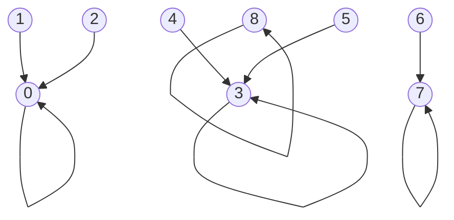

--

### 例子 1：NCPC 組隊

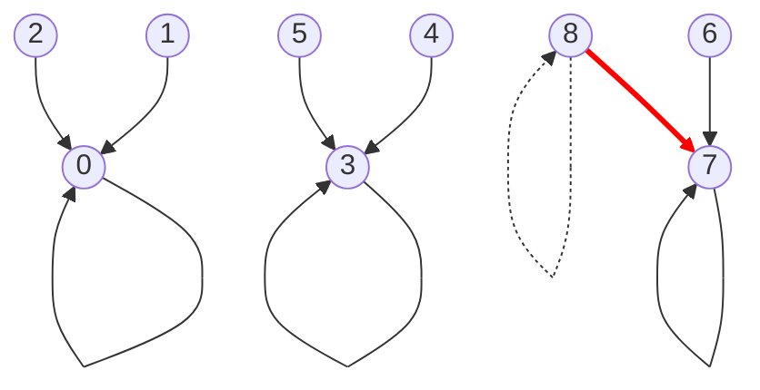

--

### 例子 2：幫派

- 每個幫派都有一個頭目
- 幫派與幫派之間沒有重複的小弟
- 如果幫派 A 打輸幫派 B，則幫派 A 加入幫派 B

--

### 例子 2：幫派

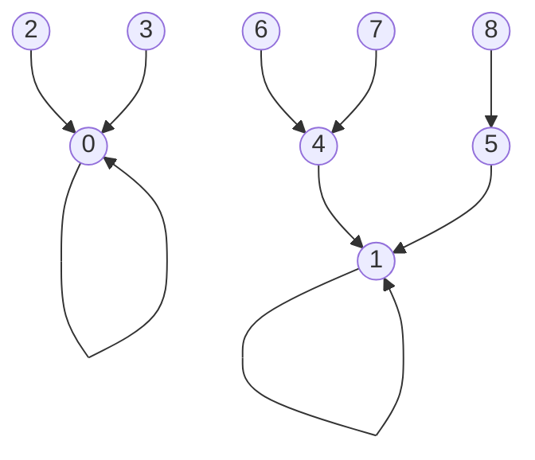

--

### 例子 2：幫派

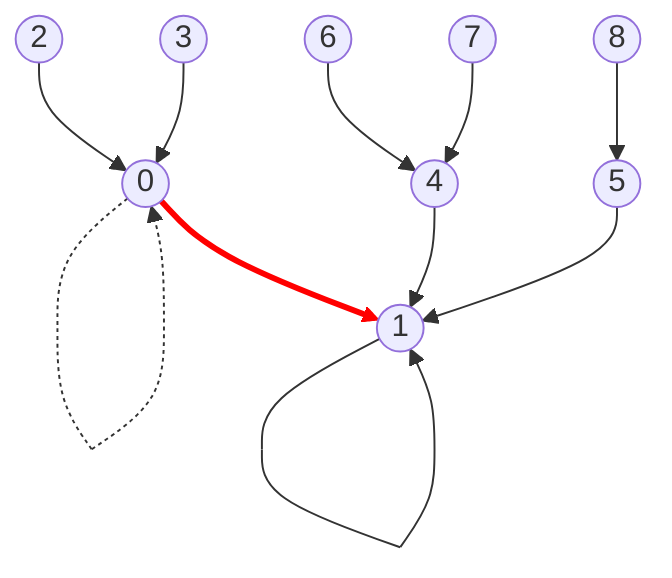

---

## 特點

--

### 特點 1

集合之間沒有交集


--

### 特點 2

需要合併、尋找功能


--

### Disjoint Set 互斥集

1. 集合之間沒有交集
2. 需要合併、尋找功能

俗稱 Merge-Find Set，中文「並查集」

---

## 樹狀儲存

Disjoint-sets Forest

--

### 存儲狀態

```cpp=
int djset[9];

djset[0] = 0; // 頭目
djset[1] = 1; // 頭目
djset[2] = 0;
djset[3] = 0;
djset[4] = 1;
djset[5] = 1;
djset[6] = 4;
djset[7] = 4;
djset[8] = 5;
```


--

### 初始化

每個人都是自己一人一團，自己當老大

```cpp=
int djset[9];

for (int i = 0; i < 9; i++) {
    djset[i] = i;
}
```

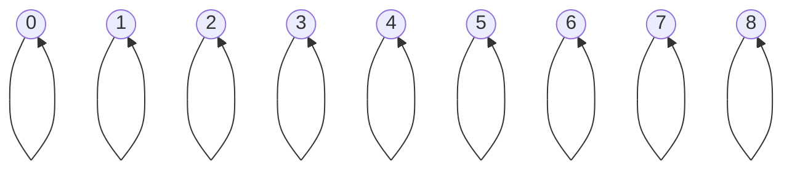

--

### 查找

找誰在哪個團裡

```cpp=
int find(int x) {
    if (djset[x] == x) {
        return x;
    }

    // 遞迴尋找頭目
    return find(djset[x]);
}

// find(7) = 1;
```

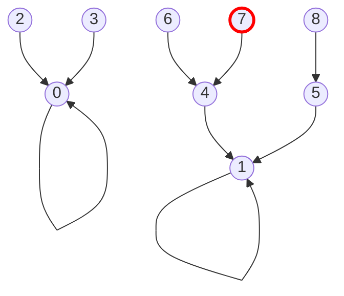

--

### 查找

找誰在哪個團裡

```cpp=
int find(int x) {
    if (djset[x] == x) {
        return x;
    }

    // 遞迴尋找頭目，同時將途中的小弟的老大設為頭目
    return djset[x] = find(djset[x]);
}

// find(7) = 1;
```

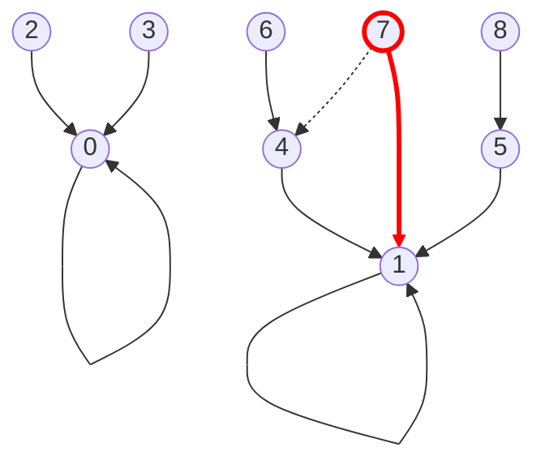

--

### 是否同團？

```cpp=
bool same(int x, int y) {
    return (find(x) == find(y));
}

// same(7, 8) = true
// same(7, 2) = false
```

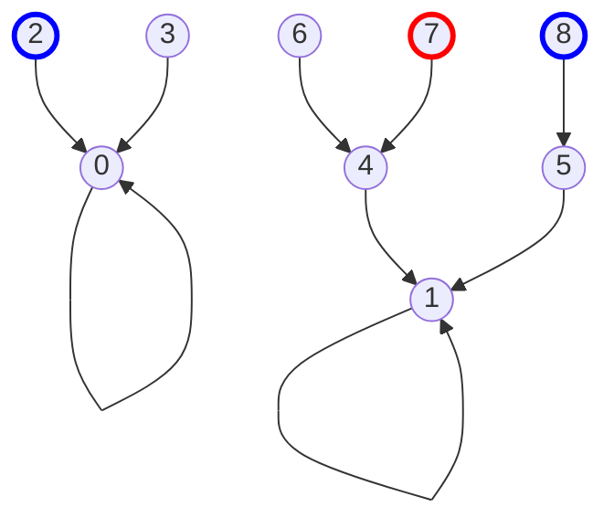

--

### 合併

```cpp=
void merge(int x, int y) {
    x = find(x);
    y = find(y);

    djset[x] = y;
}

// merge(2, 7) == merge(0, 1)
// merge(2, 3) == merge(0, 0)
```


--

### Disjoint Set 互斥集

1. 集合之間沒有交集
2. 需要合併、尋找功能

--

團體數量？各團體人數？

--

### 合併 + 團體數量

```cpp=
int group = 9; // 初始團體數量

void merge(int x, int y) {
    x = find(x);
    y = find(y);

    if (x == y) return; // 相同團體則跳過

    group--; // 減少團體數量
    djset[x] = y;
}
```

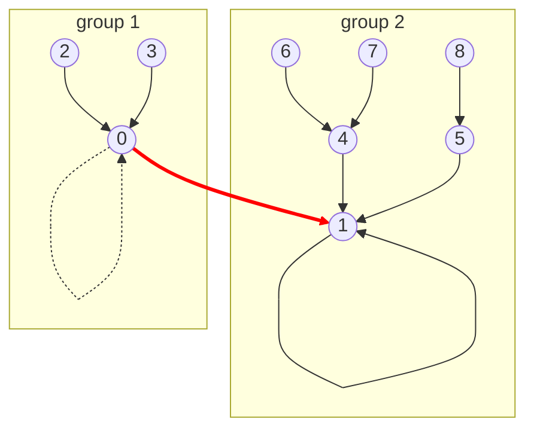

--

### 合併 + 各團體人數

1. 初始化陣列

```cpp=
int djset[9];
int dsize[9]; // 各團體人數

for (int i = 0; i < 8; i++) {
    djset[i] = i;
    dsize[i] = 1;
}
```


--

### 合併 + 各團體人數

2. 合併時更新人數

```cpp=
void merge(int x, int y) {
    x = find(x);
    y = find(y);

    if (x == y) return;

    dsize[y] += dsize[x]; // 團體 x 的人數加到團體 y 中

    group--;
    djset[x] = y;
}
```

--

### 合併 + 各團體人數

2. 合併時更新人數

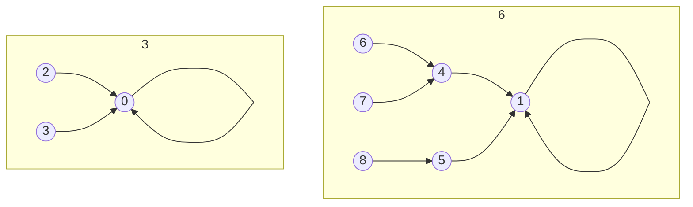

--

### 合併 + 各團體人數

2. 合併時更新人數

```cpp=
// merge(0, 1)
dsize[y] += dsize[x];
```

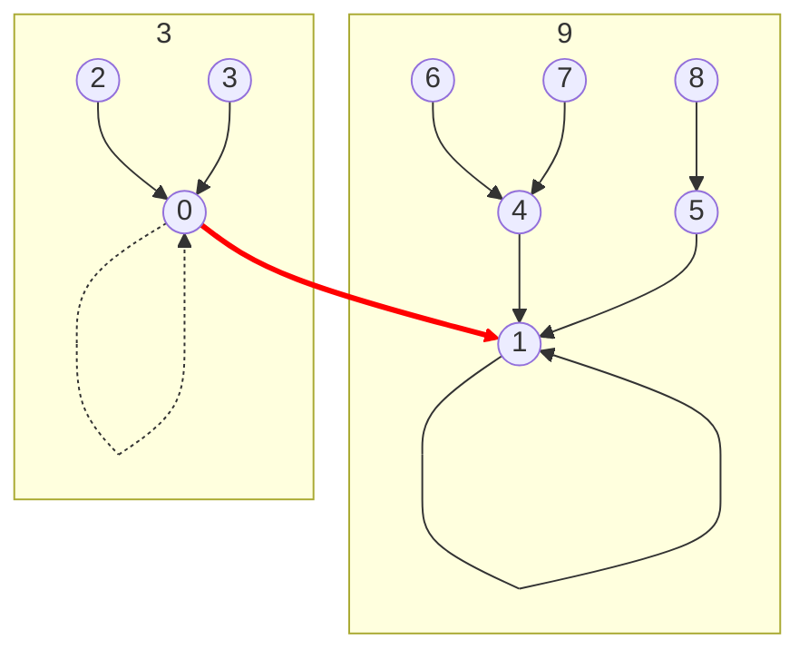

--

### 合併 + 各團體人數

2. 合併時更新人數

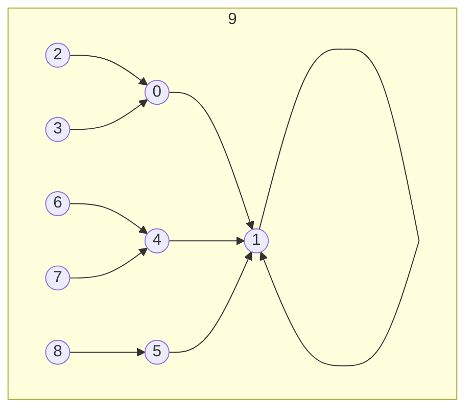

--

### 合併 + 各團體人數

3. 查詢團體人數

```cpp=
int groupSize(int x) {
    return dsize[find(x)];
}

// groupSize(0) = 9;
```

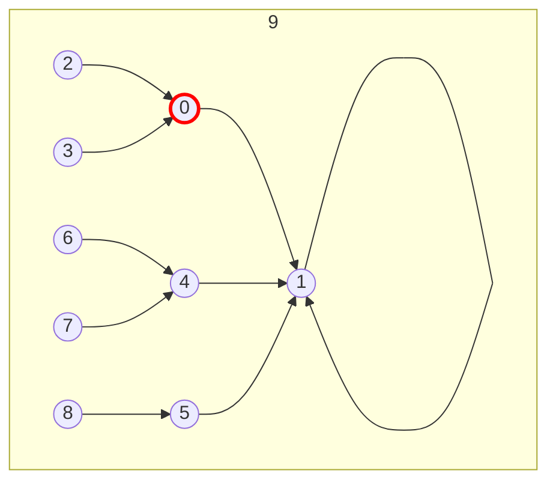

--

### 合併優化

```cpp=
void merge(int x, int y) {
    x = find(x);
    y = find(y);

    if (x == y) return;
    
    // 將小團體合併到大團體中
    if (dsize[x] > dsize[y]) {
        swap(x, y);
    }

    dsize[y] += dsize[x];

    group--;
    djset[x] = y;
}
```

--

### 合併優化

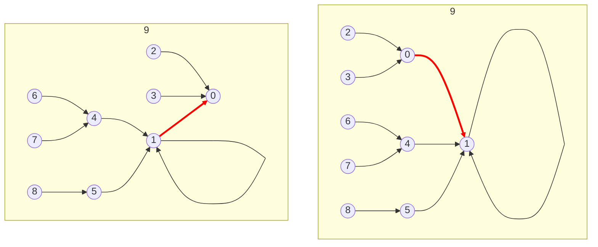

--

### 參考資料

https://web.ntnu.edu.tw/~algo/Set.html

---

## 題目

--

### pA ABC

https://codeforces.com/contest/1632/problem/A
https://vjudge.net/problem/CodeForces-1632A

--

### pB Simple Design

https://codeforces.com/contest/1884/problem/A
https://vjudge.net/problem/CodeForces-1884A

--

### pE News Distribution

https://codeforces.com/problemset/problem/1167/C
https://vjudge.net/problem/CodeForces-1167C

---

## 解答

--

### pA ABC

```cpp=
#include <bits/stdc++.h>

using namespace std;

bool solve(string str, int n) {
    if (n >= 3) {
        return false;
    }

    if (n == 1 || str == "10" || str == "01") {
        return true;
    }

    return false;
}

int main() {
    int t;
    cin >> t;

    while (t--) {
        int n;
        string str;
        
        cin >> n >> str;

        if (solve(str, n)) {
            cout << "YES\n";
        } else {
            cout << "NO\n";
        }
    }

    return 0;
}
```

--

### pB Simple Design

```cpp=
#include <bits/stdc++.h>
using namespace std;

int sumDigit(int x) {
    int sum = 0;

    while (x > 0) {
        sum += x % 10;
        x /= 10;
    }

    return sum;
}

int solve(int x, int k) {
    while (sumDigit(x) % k) {
        x++;
    }

    return x;
}

int main() {
    int t;
    cin >> t;

    while(t--) {
        int x, k;
        cin >> x >> k;

        cout << solve(x, k) << "\n";
    }

    return 0;
}

```

--

### pE News Distribution

```cpp=
#include <bits/stdc++.h>
using namespace std;

vector<int> djset, dsize;

int find(int x) {
    if (djset[x] == x) {
        return x;
    }

    return djset[x] = find(djset[x]);
}

void merge(int x, int y) {
    x = find(x);
    y = find(y);

    if (x == y) {
        return;
    }

    if (dsize[x] > dsize[y]) {
        swap(x, y);
    }

    djset[x] = y;
    dsize[y] += dsize[x];
}

int groupSize(int x) {
    return dsize[find(x)];
}

int main() {
    int n, m;
    cin >> n >> m;

    djset = vector<int>(n, 0);
    dsize = vector<int>(n, 0);

    for (int i = 0; i < n; i++) {
        djset[i] = i;
        dsize[i] = 1;
    }

    while (m--) {
        int k;
        cin >> k;

        if (k == 0) {
            continue;
        }

        int tmp = 0, x = 0;
        for (int i = 0; i < k; i++) {
            cin >> x;

            if (i == 0) {
                tmp = x - 1;
            } else {
                unite(tmp, x - 1);
            }
        }
    }

    for (int i = 0; i < n; i++) {
        if (i != 0) cout << ' ';
        cout << groupSize(i);
    }
    cout << "\n";

    return 0;
}

```
